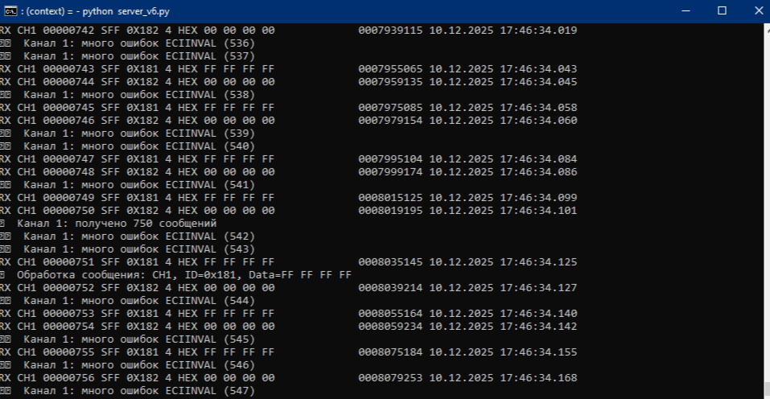
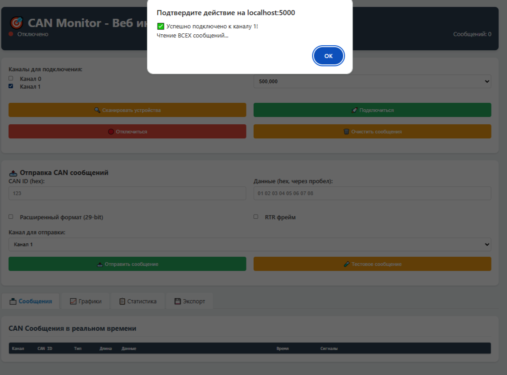
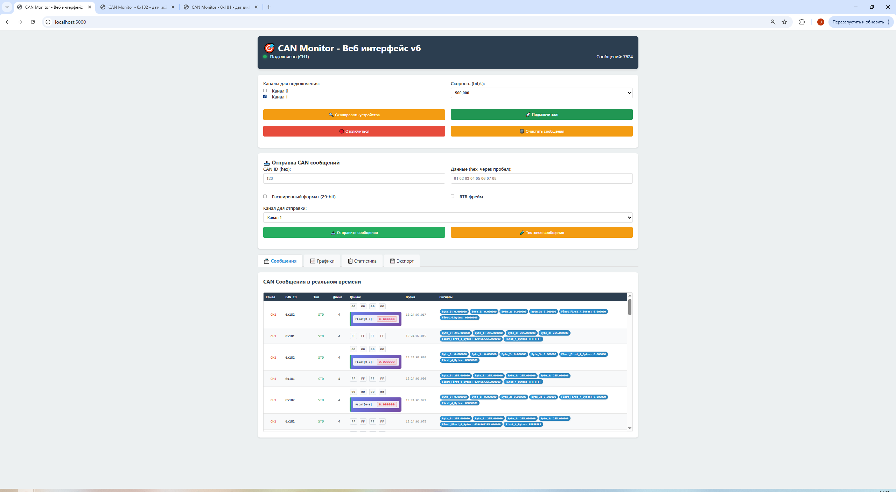
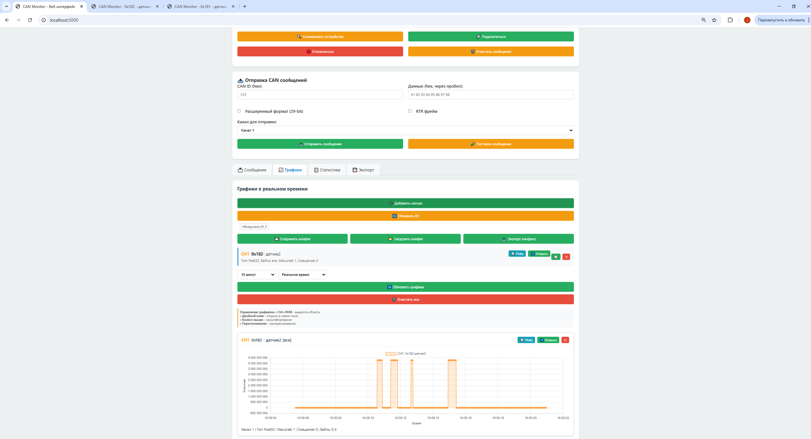
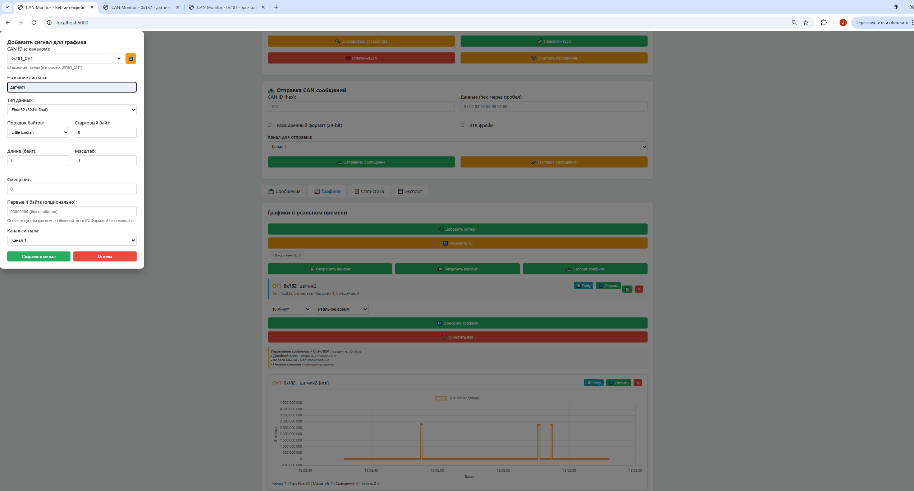
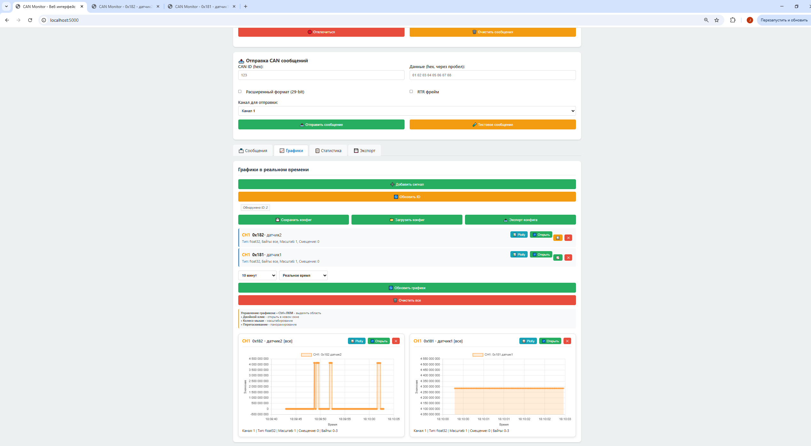
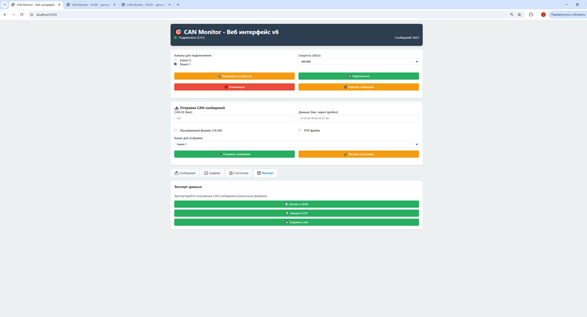
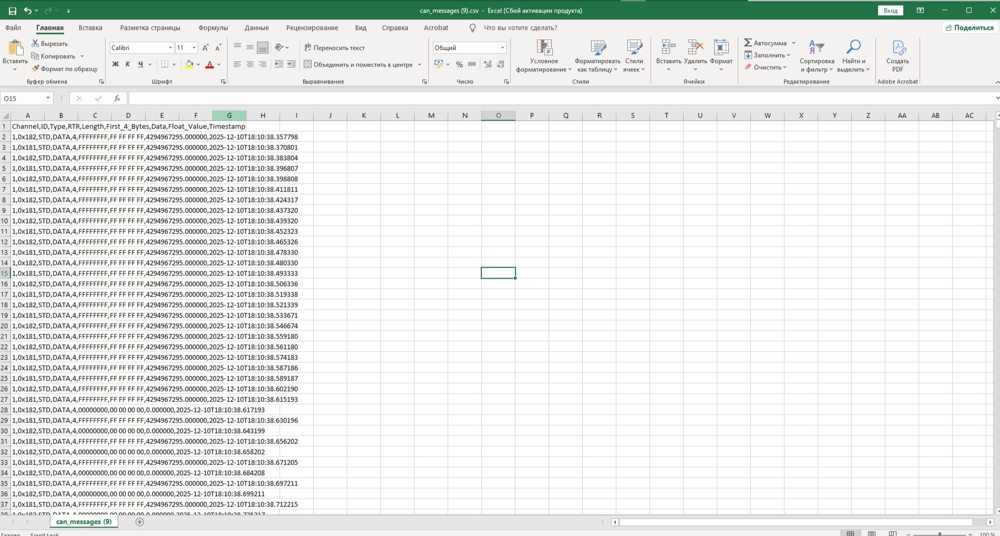
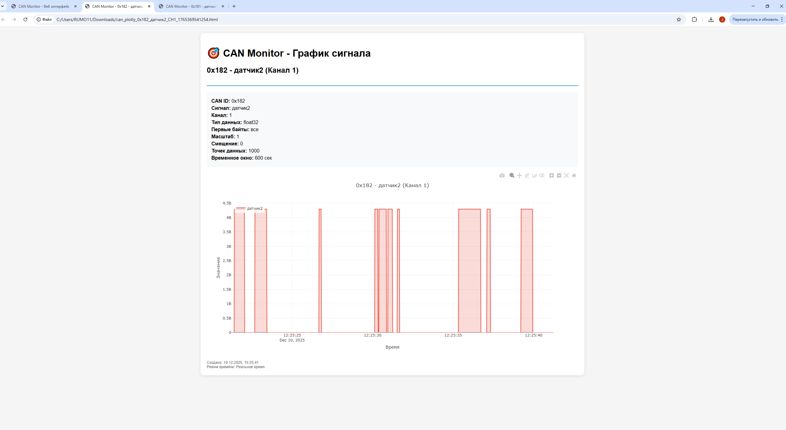

# Руководство по запуску CAN Monitor - Веб интерфейс v6

## Установка проекта
1. Распаковать проект в какой-нибудь рабочей папке:

        папка/
        ├── server_v6.py           
        ├── can_receiver.py  
        ├── chai.py       
        ├── requirements.txt  
        ├── static/
        │   └── app6.js           
        └── templates/
            └── index_v6.html     

Для работы приложения нужно иметь на компьютере установленный  [python](https://www.python.org/downloads/). 

Чтобы проверить, что он установлен: в командной строке выполнить:

        python --version
        или
        python3 --version

Далее из папки выполнить команду:

        pip install -r requirements.txt

## Запуск проекта

1. Для начала работы с логгером сообщений CAN в командной строке выполнить:

        python server_v6.py

2. Открыть браузер

3. Перейти по адресу: http://localhost:5000

 - Выбрать канал (сейчас доступен функционал для работы только с одним каналом, поэтому галочка должна стоять только рядом с тем, каналом который будет использоваться далее);
 - Нажать кнопку подключиться (в консоле и в веб-интерфейсе начнут сыпаться все сообщения)

    

    

    

## Работа с веб-интерфейсом

1. Далее во вкладке Графики нажать кнопку Добавить сигнал:

    

2. Заполнить поля CAN_ID, Название сигнала (остальные - опционально):

    

    

3. Во вкладке Экспорт можно сохранить лог в csv, json формат (ВАЖНО: делать это пока сервер запущен и подключение активно):
    
    

4. Также из вкладки Графики можно сохранить график в формате Plotly (для быстрой деионстрации):
    